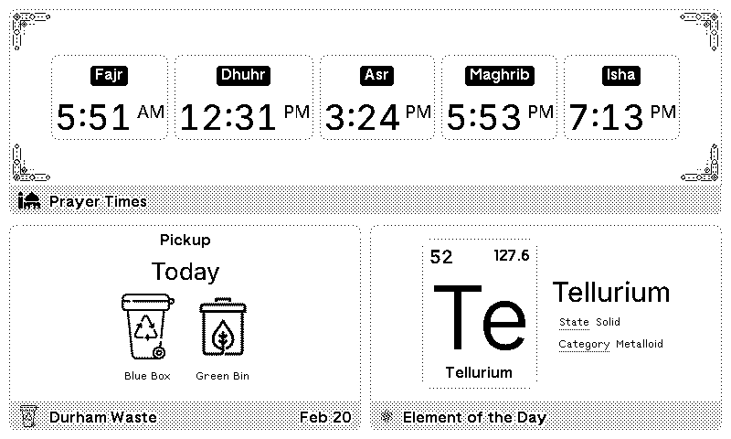
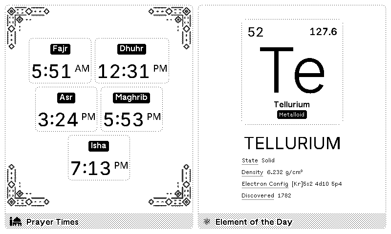

# TRMNL Plugin Template

A complete, production-ready starter template for building custom plugins for [TRMNL](https://trmnl.com) devices. This template provides everything you need to create, test, and deploy a TRMNL plugin.

## 🚀 Quick Start

### Prerequisites

- Understanding of [TRMNL Framework](https://trmnl.com/framework)
- Familiarity with [Liquid templating](https://shopify.github.io/liquid/)
- A backend service for data fetching (for polling strategy)

### Getting Started

1. **Clone this repository** as your starting point:
   ```bash
   git clone https://github.com/your-username/your-plugin-name.git
   cd your-plugin-name
   ```

2. **Customize the template files**:
   - Update `settings.yml` with your plugin configuration
   - Update `custom-fields.yml` with your form fields
   - Edit templates in `templates/` folder to your design

3. **Update the copilot instructions**:
   - Edit `.github/copilot-instructions.md` with your project details
   - Follow the [Template Usage Guide](https://github.com/hossain-khan/trmnl-plugin-template/blob/main/.github/TEMPLATE_USAGE.md)

4. **Test in TRMNL Markup Editor**:
   - Copy a template to the [TRMNL Markup Editor](https://editor.trmnl.com)
   - Preview across different device sizes
   - Test with sample data

## 📁 Project Structure

```
your-plugin-name/
├── .github/
│   ├── copilot-instructions.md    # AI assistant context (customize this!)
│   └── TEMPLATE_USAGE.md           # Instructions for using the template
├── assets/
│   ├── icon/                       # Your plugin icon(s)
│   └── demo/                       # Demo screenshots
├── templates/
│   ├── shared.liquid               # Reusable components
│   ├── full.liquid                 # Full-screen layout
│   ├── half_horizontal.liquid      # Side-by-side layout
│   ├── half_vertical.liquid        # Stacked layout
│   └── quadrant.liquid             # Compact corner layout
├── settings.yml                    # Plugin configuration
├── custom-fields.yml               # Form field definitions
├── LICENSE                         # License (MIT by default)
└── README.md                       # This file
```

## 🎨 Template Files

### Core Templates

- **`shared.liquid`**: Reusable components and utility templates
  - Error state component
  - Data display components
  - Metric cards
  - Status badges
  - Title bar template

- **`full.liquid`**: Full-screen plugin display
  - Best for main data presentation
  - Padding: `p--2` (standard)
  - Includes optional secondary content area

- **`half_horizontal.liquid`**: Side-by-side layout
  - Best for comparative displays
  - Main content on left/right side
  - Responsive: switches to vertical on portrait
  - Constrained secondary content

- **`half_vertical.liquid`**: Stacked layout
  - Best for primary + secondary content
  - Primary content fills space
  - Secondary content at bottom
  - Compact spacing

- **`quadrant.liquid`**: Quarter-size compact display
  - Minimal information only
  - Tight padding (`p--1`)
  - Every pixel counts

### Layout Previews

| Full Layout | Half Horizontal |
|---|---|
|  |  |
| **Half Vertical** | **Quadrant** |
|  |  |

## ⚙️ Configuration Files

### `settings.yml`

Configure your plugin's behavior:

```yaml
strategy: "polling"                    # How to fetch data: polling, webhook, static
polling_url: "https://api.example.com" # Endpoint to fetch data from
refresh_frequency: 15                  # Update interval in minutes (1-1440)
layouts: [full, half_horizontal, ...]  # Available layout types
```

**Strategy Options**:
- **polling**: TRMNL fetches data at specified intervals (best for most plugins)
- **webhook**: You push data to TRMNL when it changes (lower latency)
- **static**: Hardcoded data (simple displays)

### `custom-fields.yml`

Define user-facing form fields:

```yaml
- key: "api_key"
  type: "text"
  label: "API Key"
  required: true

- key: "data_source"
  type: "select"
  options:
    - label: "Option A"
      value: "a"
```

**Field Types**: `text`, `long_text`, `select`, `checkbox`, `number`, `url`, `email`

Access in templates:
```liquid
{{ trmnl.plugin_settings.custom_fields_values.api_key }}
```

## 🎯 Key Features

### Responsive Design
- Supports 4+ device sizes (600px - 1024px+ widths)
- Breakpoint system: `sm:`, `md:`, `lg:`
- Portrait orientation support: `portrait:`
- Bit-depth variants: `1bit:`, `2bit:`, `4bit:`, `8bit:`

### TRMNL Framework Utilities
All templates use framework utilities for consistency:

**Layout**: `flex`, `flex--row`, `flex--col`, `grid`, `gap--*`, `h--full`
**Typography**: `title`, `value`, `label`, `description`
**Visual**: `bg--white`, `rounded`, `outline`, `text--center`

Example:
```liquid
<div class="flex flex--row gap--medium h--full">
  <span class="value value--large md:value--xlarge">42</span>
  <span class="title md:title--large">Example</span>
</div>
```

### Error States
All templates include error state fallbacks for unconfigured plugins:

```liquid

  <!-- Show plugin content -->

  <!-- Show helpful error message -->
  

```

### Reusable Components
`shared.liquid` provides ready-to-use components:

```liquid



```

## 🔄 Data Flow

### Polling Strategy (Default)

```
1. User configures plugin in TRMNL
2. TRMNL sends GET request to polling_url at refresh_frequency
3. Your backend fetches/generates data
4. Backend returns JSON with template variables
5. TRMNL merges JSON into templates
6. Rendered content sent to e-ink display
```

Your backend should return JSON like:

```json
{
  "has_data": true,
  "title": "Example Value",
  "value": 42,
  "status": "success",
  "metadata": "Last updated: 2 minutes ago"
}
```

Template accesses via:
```liquid
{{ title }}
{{ value }}
{{ status }}
{{ metadata }}
```

## 🧪 Testing

### Using TRMNL Markup Editor

1. Go to [editor.trmnl.com](https://editor.trmnl.com)
2. Copy your template code (e.g., from `full.liquid`)
3. Add sample JSON data under "Data" section
4. Preview across device sizes using device selector
5. Check responsive behavior

### Test Scenarios

✅ **Happy Path**
- Valid config with complete data
- Data displays correctly in all layouts
- Responsive across device sizes

⚠️ **Edge Cases**
- Empty/minimal data
- Long text (100+ characters)
- Special characters & unicode
- Null/undefined values

❌ **Error States**
- No configuration
- Invalid configuration
- Failed data fetch
- Malformed data

### Manual Checklist

- [ ] Test all layouts (full, half_horizontal, half_vertical, quadrant)
- [ ] Verify on all device sizes (sm, md, lg)
- [ ] Test with minimal data
- [ ] Test with maximum data
- [ ] Verify text truncation
- [ ] Check error states
- [ ] Test portrait mode
- [ ] Verify bit-depth variants
- [ ] Check accessibility

## 📚 Development Resources

### TRMNL Documentation
- [Framework Design Docs](https://trmnl.com/framework) - Complete design system reference
- [Device Models API](https://trmnl.com/api/models) - Device specifications
- [Plugin Guides](https://help.trmnl.com/en/collections/7820559-plugin-guides) - How-to guides
- [Liquid 101](https://help.trmnl.com/en/articles/10671186-liquid-101) - Liquid basics
- [Advanced Liquid](https://help.trmnl.com/en/articles/10693981-advanced-liquid) - Advanced techniques

### Responsive Breakpoints

| Device | Size | Width | Display | Breakpoint |
|--------|------|-------|---------|-----------|
| TRMNL X | Large | 1040px | 4-bit (16 shades) | lg: |
| TRMNL OG V2 | Medium | 800px | 2-bit (4 shades) | md: |
| TRMNL OG | Medium | 800px | 1-bit (2 shades) | md: |
| Kindle 2024 | Small | 800px | 8-bit (256 shades) | sm: |
| BYOD Devices | Various | 600-1200px | Various | sm:/md:/lg: |

### Framework Utilities Quick Reference

```liquid
<!-- Layout -->
<div class="flex flex--row flex--center-x gap--medium h--full">

<!-- Typography -->
<span class="value value--small md:value--large lg:value--xlarge">42</span>
<span class="title title--medium">Heading</span>
<span class="label">Label</span>
<span class="description">Description text</span>

<!-- Spacing -->
<div class="p--2 mb--small gap--medium">

<!-- Visual -->
<div class="bg--white rounded outline">


<!-- Responsive -->
<div class="flex flex--col portrait:flex--row md:gap--large">
```

## 🐛 Common Issues & Solutions

### Layout Breaking on Different Devices
- Test all 4 device sizes in TRMNL Markup Editor
- Use responsive breakpoints consistently
- Avoid complex CSS - use framework utilities instead

### Text Overflow
- Use `data-clamp="2"` to limit lines
- Set `max-width` on text containers
- Test with long sample data

### Images Not Displaying
- Always use `object-fit: contain`
- Use `image--contain` class
- Ensure URLs are HTTPS
- Check actual display with `image-dither`

### Missing Error States
- Always check `if has_data` before rendering
- Provide helpful error messages
- Test unconfigured state

## 📝 Customization Checklist

When creating your plugin:

- [ ] Customize `.github/copilot-instructions.md` with your project details
- [ ] Update `settings.yml` with your endpoint and configuration
- [ ] Update `custom-fields.yml` with your form fields
- [ ] Edit all 5 template files (`full.liquid`, etc.)
- [ ] Create your asset files (icons, demo images)
- [ ] Update this `README.md` with project-specific info
- [ ] Test in TRMNL Markup Editor with sample data
- [ ] Deploy your backend API
- [ ] Test with real data before publishing

## 🚢 Deployment

### Publishing to TRMNL

1. Create a plugin recipe in [TRMNL Dashboard](https://app.trmnl.com)
2. Upload template files:
   - All 5 `.liquid` files
   - Icons and assets
3. Configure settings.yml and custom-fields.yml
4. Add description, screenshots, and documentation
5. Submit for review

### Backend Deployment

Deploy your API endpoint somewhere accessible:
- Cloudflare Workers
- Node.js server
- Python server
- Serverless (Lambda, Cloud Functions, etc.)

Ensure:
- ✅ HTTPS only
- ✅ Returns valid JSON
- ✅ Responds in <3 seconds
- ✅ Error handling included

## 📄 License

This template is provided under the MIT License - see [LICENSE](LICENSE) for details.

## 🤝 Contributing

Improvements and contributions welcome! If you:
- Find better patterns
- Improve documentation
- Fix bugs
- Add features

Please open an issue or pull request.

## 📞 Getting Help

- Check the [TRMNL Framework docs](https://trmnl.com/framework)
- Review the [copilot-instructions.md](.github/copilot-instructions.md)
- Check [TRMNL Help Center](https://help.trmnl.com)
- Open an issue in this repository

---

**Happy building! 🎉**

For questions about the template, see [TEMPLATE_USAGE.md](.github/TEMPLATE_USAGE.md).
